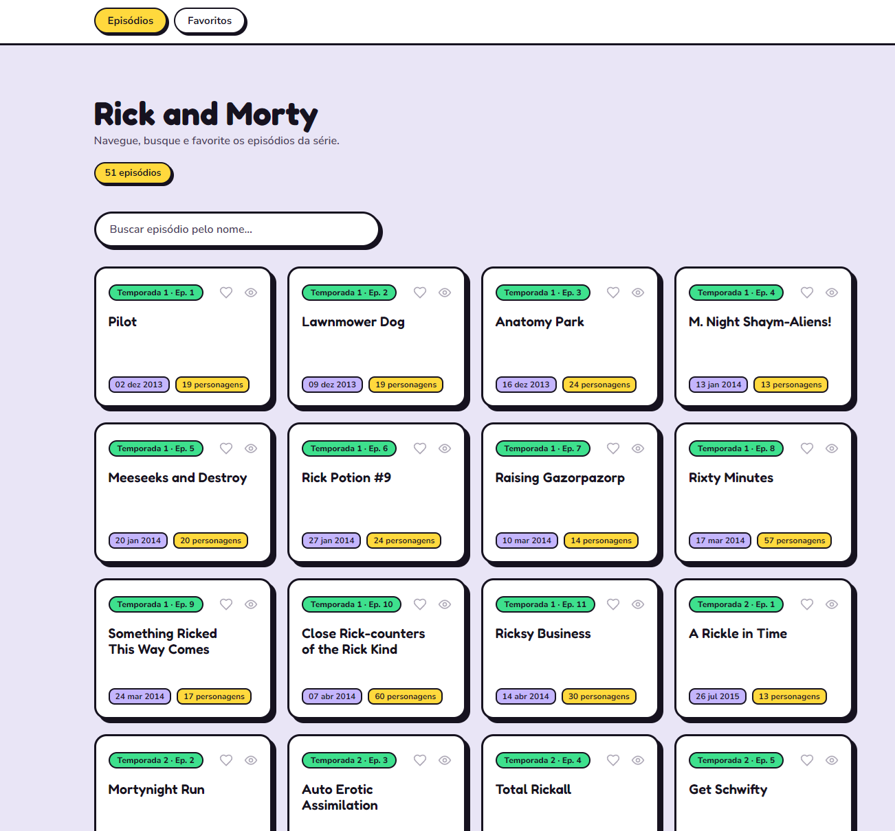

# Rick and Morty — Desafio AZShip Front-end Web

Aplicação web em React para explorar os episódios de *Rick and Morty*, consumindo a
[Rick and Morty API](https://rickandmortyapi.com/graphql) (GraphQL). Permite listar, buscar,
detalhar, favoritar e marcar episódios como vistos.

**🔗 No ar:** https://rickandmorty-5a4b2.web.app



---

## Funcionalidades

Todos os requisitos do desafio, mais alguns extras:

- [x] **Listar episódios** — número, nome, data de exibição e quantidade de personagens
- [x] **Detalhar episódio** — lista de personagens com foto, nome, espécie e status
- [x] **Favoritar / desfavoritar** episódios
- [x] **Marcar como visto**
- [x] **Listar favoritos** — em tela própria
- [x] **Buscar** episódio pelo nome
- [x] **Paginação** da listagem
- [x] **Barra de navegação** entre Episódios e Favoritos
- [x] **Esqueletos de carregamento** (skeletons) em todas as telas
- [x] **Responsivo** e com identidade visual própria

Favoritos e vistos são **persistidos no navegador** (`localStorage`), então sobrevivem a um
reload. Como a API é somente leitura (não tem *mutations*), esse estado é do usuário, mantido
localmente.

---

## Rodando o projeto

Requer **Node.js 20.19+** (ou 22.12+) — exigência do Vite 8.

```bash
npm install
npm run dev
```

A aplicação sobe em **http://localhost:3005**.

### Scripts

| Script | O que faz |
|---|---|
| `npm run dev` | Dev server na porta 3005 |
| `npm run build` | Type-check (`tsc -b`) e build de produção em `dist/` |
| `npm run preview` | Serve o build gerado, também na 3005 |
| `npm run lint` | Análise estática com oxlint |

---

## Stack e decisões

| Ferramenta | Papel | Por quê |
|---|---|---|
| **React 19 + TypeScript** | UI e tipagem | Base do desafio |
| **Vite 8** | Build e dev server | Rápido, template `react-ts` |
| **TanStack Query 5** | Dados remotos | Cache, loading e erro sem reimplementar `useEffect + useState` em cada tela |
| **Zustand 5** (+ `persist`) | Favoritos e vistos | Estado reativo do usuário, persistido em `localStorage` |
| **React Router 7** | Navegação | Rotas e deep-linking |
| **CSS Modules** | Estilo e responsividade | Nativo do Vite, sem dependência extra |
| **fetch nativo** | Transporte GraphQL | Endpoint único, sem necessidade de Apollo/axios |


---

## Arquitetura

O projeto separa **lógica** de **apresentação**: a lógica não conhece cor nem espaçamento, e
todo estilo mora num `.module.css` ao lado do componente. Trocar o visual não exige tocar na
lógica.

```
src/
├── pages/                    # uma tela por arquivo
│   ├── Home.tsx              # listagem + busca + paginação
│   ├── EpisodeDetailPage.tsx # detalhe do episódio + personagens
│   └── FavoritesPage.tsx     # lista de favoritos
├── components/               # apresentação reutilizável
│   ├── EpisodeCard.tsx       # card do episódio (clicável, com ações)
│   ├── CharacterCard.tsx     # card do personagem
│   ├── NavBar.tsx / Layout.tsx  # navegação compartilhada
│   ├── *Skeleton.tsx         # esqueletos de carregamento
│   ├── SearchField.tsx / Pagination.tsx / icons.tsx
├── api/episodes.ts           # queryClient + queries do TanStack Query
├── graphql/queries.ts        # documentos GraphQL (strings)
├── lib/                      # graphqlClient (único fetch) + formatters
├── store/episodeStore.ts     # Zustand + persist (favoritos/vistos)
├── hooks/useDebouncedValue.ts# debounce da busca
├── types/api.ts              # tipos do domínio
└── index.css                 # reset + tokens de tema (:root)
```

- **Cores/tema** ficam em tokens no `:root` (`--color-portal`, `--color-blip`…); os CSS
  Modules usam `var(--…)`, nunca o hexadecimal cru — trocar o tema é editar um bloco só.
- **Um único cliente GraphQL** monta o POST e converte `json.errors` em erro. Nenhum
  componente chama `fetch` direto.
- **Estado lido por seletor** na store, para re-render granular (favoritar um episódio
  re-renderiza só aquele card).

### Rotas

| Rota | Tela |
|---|---|
| `/` | Listagem de episódios |
| `/episodio/:id` | Detalhe do episódio |
| `/favoritos` | Episódios favoritados |

---

## Deploy (Firebase Hosting)

O site é publicado no Firebase Hosting. Para atualizar:

```bash
npm run build
firebase deploy --only hosting
```

O `firebase.json` inclui um **rewrite** de `**` para `/index.html`. Isso é o que faz as rotas
client-side (`/favoritos`, `/episodio/:id`) funcionarem ao abrir por link direto ou dar F5 —
sem ele, o Hosting devolveria 404 para qualquer caminho que não fosse a raiz.

---

Desafio proposto pela equipe de engenharia da **AZShip**.
